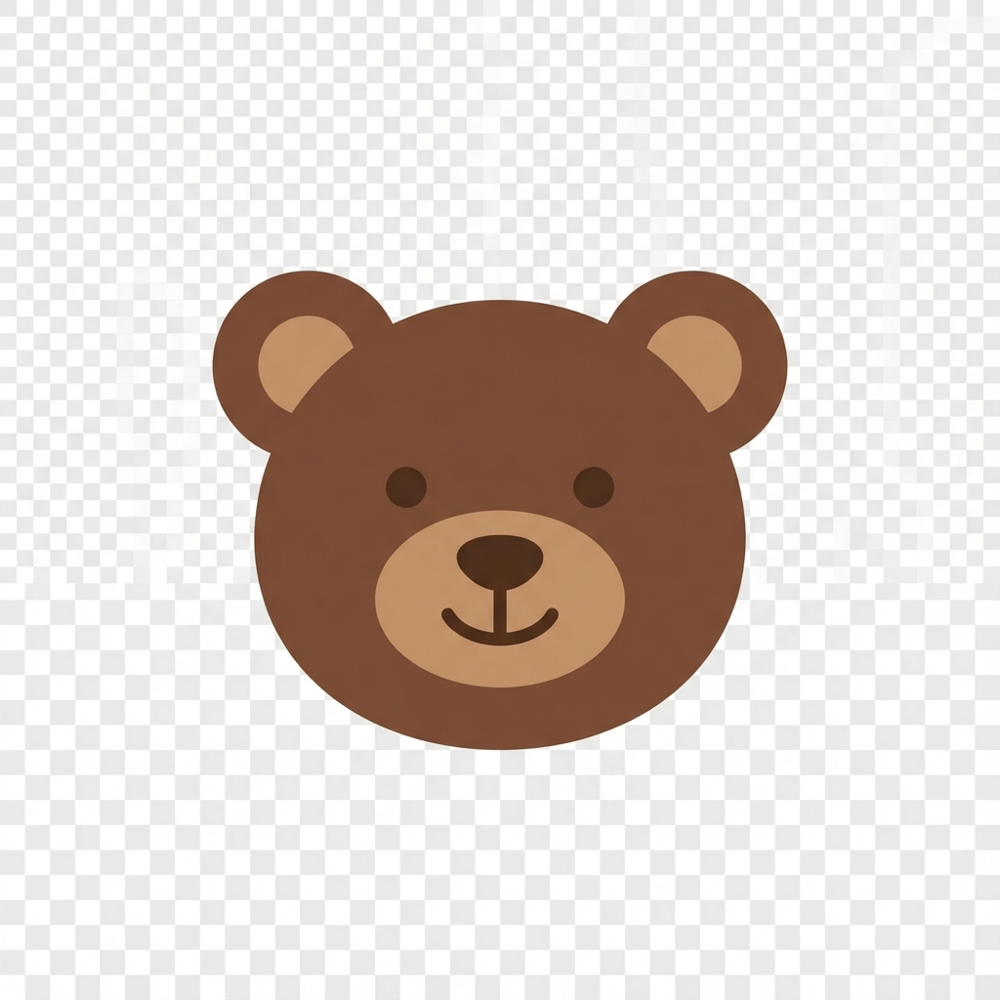

# 🧸 Aesthetic Calculator (Teddy Bear Edition)

A beautifully designed, cozy calculator web application featuring a "Chocolate & Cream" aesthetic with cute teddy bear details.


*(Note: Screen capture of the actual UI)*

## ✨ Features

*   **Aesthetic Design**: A soothing color palette of chocolate browns, creamy beiges, and soft whites.
*   **Cute Theming**: Featuring round, "paw-like" buttons and adorable teddy bear branding.
*   **Smooth Animations**:
    *   **Pop-in entry**: Elements smoothly animate in on load.
    *   **Squishy Buttons**: Tactile feel with press animations (scaling) and hover effects.
    *   **Glassmorphism**: Subtle depths and shadows for a modern feel.
*   **Full Functionality**:
    *   Basic arithmetic operations (+, -, ×, ÷)
    *   Percentage calculations
    *   Clear (AC) and Delete (DEL) functions
    *   Responsive display handling large numbers

## 🛠️ Built With

*   **HTML5**: Semantic structure.
*   **CSS3**: Custom variables, transforms, flexbox/grid, and keyframe animations.
*   **JavaScript**: Vanilla JS for calculation logic and UI interaction.
*   **Font**: [Outfit](https://fonts.google.com/specimen/Outfit) from Google Fonts for a clean, modern look.

## 🚀 How to Run

1.  **Clone or Download** the repository.
2.  **Open `index.html`** directly in your modern web browser.
    *   *OR* for the best experience (to ensure fonts and assets load correctly without local file restrictions), run a simple local server:
    ```bash
    # Using python (installed on most systems)
    python -m http.server
    
    # OR using Node.js
    npx http-server
    ```
3.  Navigate to `http://localhost:8000` (or whichever port is displayed).

## 🎨 Customization

You can adjust the colors in the `:root` variables in `style.css`:

```css
:root {
    --bg-color: #FFF8E7; /* Background */
    --calculator-bg: #6F4E37; /* Calculator Body */
    --btn-bg: #8D6E63; /* Buttons */
    /* ... and more */
}
```

## 📄 License

This project is open source and available for personal and educational use. Enjoy the cozy vibes! 🐻
